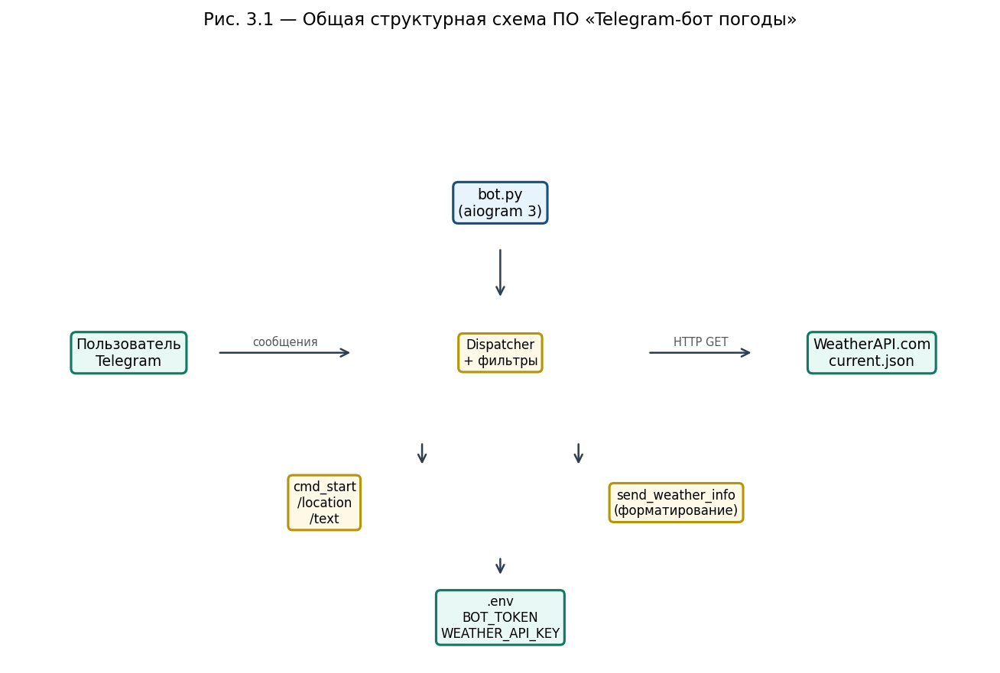
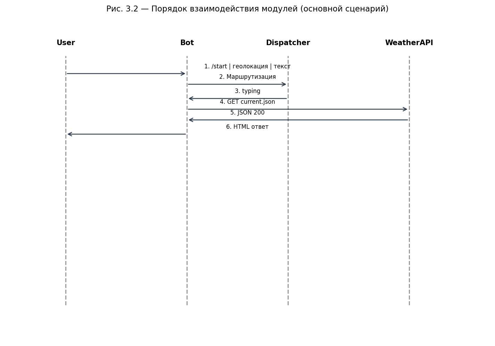
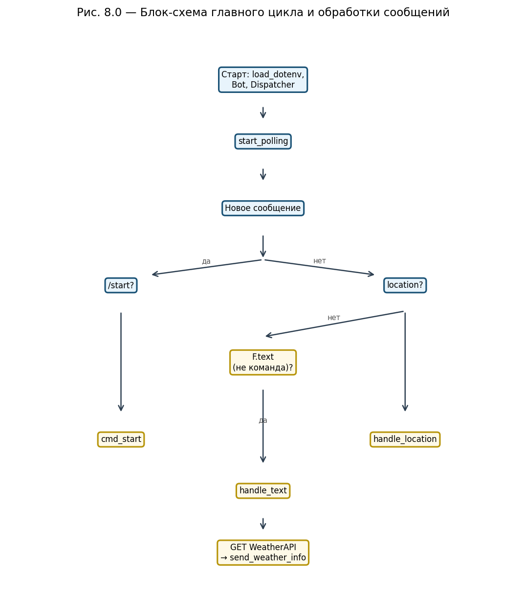
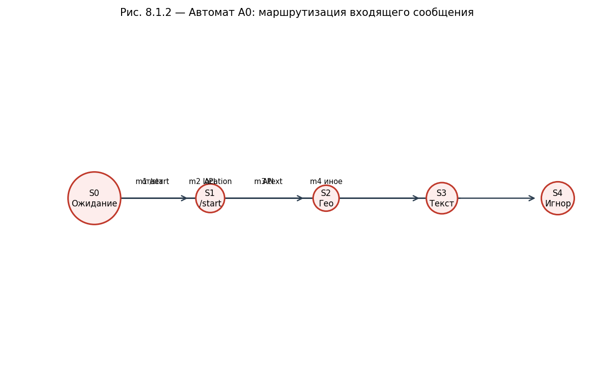
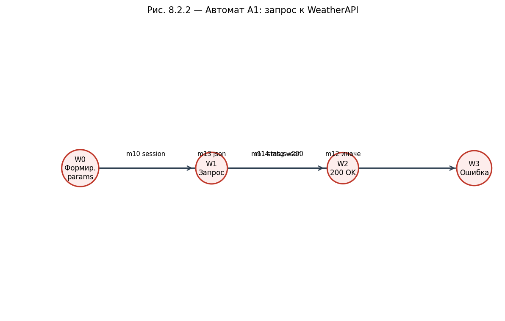
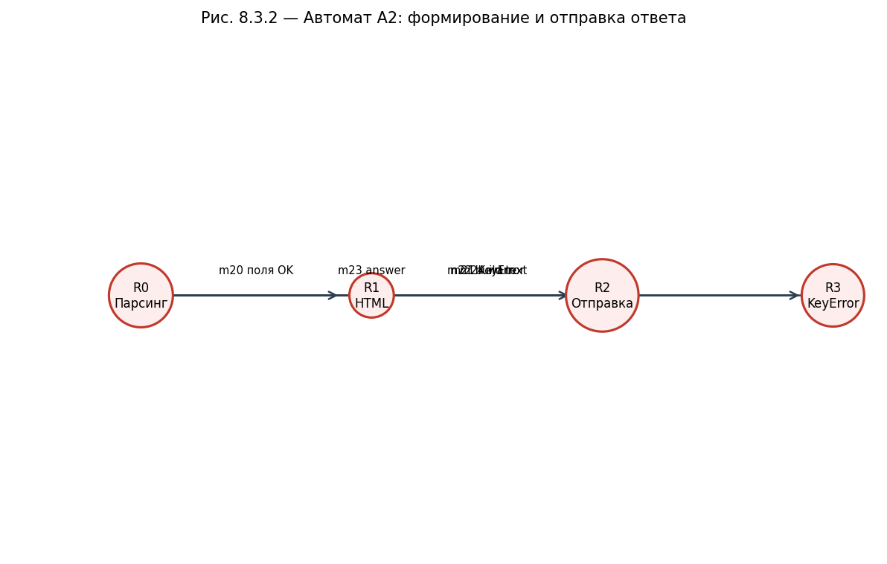

# ТУККЕЛЬ Н.И., ШАЛЬТО А.А., ВЕРБА М.Т., LOST X

## TELEGRAM-БОТ ТЕКУЩЕЙ ПОГОДЫ

### ПРОГРАММНАЯ ДОКУМЕНТАЦИЯ

**Используемые технологии:** Python 3.10+, aiogram 3.x, aiohttp, python-dotenv, WeatherAPI.com (REST JSON)

**Место разработки:** ЮЖНО-САХАЛИНСК  
**Год:** 2026

---

## ОГЛАВЛЕНИЕ

1. [Введение](#1-введение)
2. [Частное техническое задание на подсистему получения погоды](#2-частное-техническое-задание-на-подсистему-получения-погоды)
3. [Структурная схема программного обеспечения](#3-структурная-схема-программного-обеспечения)
4. [Перечень и нумерация событий](#4-перечень-и-нумерация-событий)
5. [Перечень и нумерация входных переменных](#5-перечень-и-нумерация-входных-переменных)
6. [Перечень и нумерация выходных воздействий](#6-перечень-и-нумерация-выходных-воздействий)
7. [Пояснения к используемой нотации](#7-пояснения-к-используемой-нотации)
8. [Системозависимая часть](#8-системозависимая-часть)
9. [Исходные тексты системозависимой части](#9-исходные-тексты-системозависимой-части)
10. [Протоколы функционирования](#10-протоколы-функционирования)
11. [Требования к программному обеспечению](#11-требования-к-программному-обеспечению)
12. [Требования к программной документации](#12-требования-к-программной-документации)
13. [Технико-экономические показатели](#13-технико-экономические-показатели)
14. [Стадии и этапы разработки](#14-стадии-и-этапы-разработки)
15. [Порядок контроля и приёмки](#15-порядок-контроля-и-приёмки)
16. [Установка и эксплуатация](#16-установка-и-эксплуатация)

---

## 1. ВВЕДЕНИЕ

Настоящий документ представляет собой проектную документацию на программное обеспечение **«Telegram-бот текущей погоды»** (далее — **Система**, **Бот**).

Система предназначена для предоставления пользователям мессенджера Telegram актуальной информации о погоде в заданной точке Земли. Пользователь может:

- отправить **геолокацию** (встроенное вложение Telegram);
- ввести **текстовый запрос** — название города, района, страны или произвольный адрес на языке, поддерживаемом сервисом WeatherAPI.com.

Бот обращается к внешнему REST API, получает JSON с текущими метеоданными, форматирует ответ на русском языке и отправляет сообщение в чат с разметкой HTML.

Документация разработана в соответствии с требованиями к курсовому проектированию и демонстрирует применение **автоматного подхода** (SWITCH-технологии) для описания логики обработки сообщений, запросов к API и формирования ответа.

**Состав репозитория:**

| Компонент | Назначение |
|-----------|------------|
| `bot.py` | Единственный исполняемый модуль: инициализация, обработчики, запуск polling |
| `.env` | Секреты: токен Telegram и ключ WeatherAPI (не включается в git) |
| `.env.example` | Шаблон переменных окружения |
| `requirements.txt` | Зависимости Python |
| `doc/` | Программная документация и блок-схемы (PNG) |

---

## 2. ЧАСТНОЕ ТЕХНИЧЕСКОЕ ЗАДАНИЕ НА ПОДСИСТЕМУ ПОЛУЧЕНИЯ ПОГОДЫ

### 2.1. Назначение подсистемы

Подсистема получения и отображения погоды является составной частью программного комплекса и обеспечивает:

- приём входящих обновлений от Telegram Bot API через long polling (aiogram);
- маршрутизацию сообщений по типу (команда `/start`, геолокация, текст);
- формирование HTTP GET-запроса к `http://api.weatherapi.com/v1/current.json`;
- разбор JSON-ответа и построение пользовательского сообщения;
- индикацию «печатает…» (`send_chat_action`) на время ожидания ответа API;
- обработку ошибок сети, HTTP и структуры данных.

### 2.2. Функциональные требования

#### 2.2.1. Команда приветствия

При получении команды `/start` бот обязан отправить текстовое приветствие с инструкцией по использованию (геолокация или название места).

#### 2.2.2. Запрос по геолокации

При получении объекта `Message` с заполненным полем `location` подсистема должна:

1. Извлечь `latitude` и `longitude`.
2. Передать в API параметр `q` в формате `"<lat>,<lon>"`.
3. При успешном ответе (HTTP 200) вызвать функцию `send_weather_info`.

#### 2.2.3. Запрос по тексту

При получении текстового сообщения, **не** являющегося командой (строка не начинается с `/` после `strip()`), подсистема должна передать содержимое текста в параметр `q` API.

Пустые строки и команды игнорируются (обработчик завершается без ответа).

#### 2.2.4. Формат ответа пользователю

Сообщение должно содержать (при успешном разборе):

- название населённого пункта и страну;
- температуру °C и «ощущается как»;
- текстовое описание условий (облачность, осадки и т.д.);
- влажность %;
- скорость и направление ветра;
- метку времени последнего обновления данных API.

Специальные символы HTML в полях из API экранируются функцией `html.escape`.

#### 2.2.5. Обработка ошибок

| Ситуация | Поведение |
|----------|-----------|
| HTTP ≠ 200 (геолокация) | Сообщение «Не удалось получить данные о погоде» |
| HTTP ≠ 200 (текст) | Сообщение с `error.message` из JSON API, если доступно |
| Исключение aiohttp/сеть | Лог ERROR + «Произошла ошибка при обращении к сервису погоды» |
| KeyError при разборе JSON | Лог ERROR + «Не удалось обработать данные о погоде» |

### 2.3. Требования к производительности

- Время ответа пользователю определяется задержкой WeatherAPI и сети; целевое время — **не более 5 с** при стабильном интернете.
- Бот рассчитан на **однопоточную** асинхронную модель aiogram; параллельная обработка множества чатов обеспечивается event loop asyncio.
- Допускается обработка неограниченного числа пользователей в пределах лимитов Telegram и тарифа WeatherAPI.

### 2.4. Требования к конфигурированию

- `BOT_TOKEN` — токен бота от [@BotFather](https://t.me/BotFather).
- `WEATHER_API_KEY` — ключ с [weatherapi.com](https://www.weatherapi.com/).
- Параметр `lang=ru` задан в коде для локализации текстовых описаний погоды в ответе API.

### 2.5. Ограничения

- Используется только endpoint **current** (текущая погода), без прогноза на несколько дней.
- Запросы к API выполняются по **HTTP** (не HTTPS) — как в исходной реализации; при развёртывании в production рекомендуется `https://api.weatherapi.com`.
- Отсутствует персистентное хранилище истории запросов и избранных городов.

---

## 3. СТРУКТУРНАЯ СХЕМА ПРОГРАММНОГО ОБЕСПЕЧЕНИЯ

### 3.1. Общая структурная схема

Программа построена по **монолитному одномодульному** принципу: весь прикладной код сосредоточен в `bot.py`. Логически выделяются следующие компоненты:

| Модуль / компонент | Файл | Ответственность |
|--------------------|------|-----------------|
| Загрузка конфигурации | `bot.py` (строки 9–12) | `load_dotenv()`, чтение `BOT_TOKEN`, `WEATHER_API_KEY` |
| Инициализация Telegram | `bot.py` (17–19) | `Bot`, `Dispatcher` |
| Обработчик `/start` | `cmd_start` | Приветствие |
| Обработчик геолокации | `handle_location` | Запрос API по координатам |
| Обработчик текста | `handle_text` | Запрос API по строке |
| Форматирование ответа | `send_weather_info` | Парсинг JSON → HTML сообщение |
| Точка входа | `main()` | `dp.start_polling(bot)` |

**Рисунок 3.1 — Общая структурная схема:**



### 3.2. Порядок взаимодействия частей подсистемы

1. Пользователь отправляет сообщение в Telegram.
2. Telegram Bot API доставляет update процессу бота (long polling).
3. `Dispatcher` выбирает первый подходящий зарегистрированный handler:
   - `Command("start")` — высший приоритет для `/start`;
   - `lambda: message.location is not None` — для геолокации;
   - `F.text` — для остального текста.
4. Выбранный handler вызывает `send_chat_action(typing)`.
5. Создаётся `aiohttp.ClientSession`, выполняется GET `current.json` с `key` и `q`.
6. При статусе 200 JSON передаётся в `send_weather_info`.
7. Пользователь получает HTML-сообщение в том же чате.

**Рисунок 3.2 — Диаграмма взаимодействия:**



**Рисунок 3.3 — Блок-схема обработки сообщений:**



---

## 4. ПЕРЕЧЕНЬ И НУМЕРАЦИЯ СОБЫТИЙ

События генерируются средой (Telegram, сеть, таймер polling) и обрабатываются логикой `bot.py` и автоматами A0–A2.

| Номер | Обозначение | Описание |
|-------|-------------|----------|
| m1 | `EVT_START_CMD` | Получена команда `/start` |
| m2 | `EVT_LOCATION` | Получена геолокация |
| m3 | `EVT_TEXT` | Получено текстовое сообщение (не команда) |
| m4 | `EVT_OTHER` | Прочие типы сообщений (игнор) |
| m10 | `EVT_SESSION_OPEN` | Открыта сессия aiohttp |
| m11 | `EVT_HTTP_200` | Ответ API со статусом 200 |
| m12 | `EVT_HTTP_ERROR` | Ответ API с ошибочным статусом |
| m13 | `EVT_JSON_OK` | JSON успешно разобран |
| m14 | `EVT_NETWORK_EX` | Исключение при HTTP-запросе |
| m18 | `EVT_POLL_TICK` | Очередной цикл long polling |
| m20 | `EVT_PARSE_OK` | Все поля JSON для ответа найдены |
| m21 | `EVT_PARSE_KEYERR` | KeyError при извлечении полей |
| m22 | `EVT_MSG_BUILT` | Строка HTML сформирована |
| m23 | `EVT_MSG_SENT` | `message.answer` выполнен |
| g50 | `EVT_TYPING` | Отправлен chat action «typing» |

---

## 5. ПЕРЕЧЕНЬ И НУМЕРАЦИЯ ВХОДНЫХ ПЕРЕМЕННЫХ

| Номер | Обозначение | Тип | Описание |
|-------|-------------|-----|----------|
| g1 | `BOT_TOKEN` | `str` | Токен Telegram Bot API |
| g2 | `WEATHER_API_KEY` | `str` | Ключ WeatherAPI |
| g41 | `message.text` | `str \| None` | Текст сообщения пользователя |
| g42 | `message.location` | `Location \| None` | Координаты |
| g43 | `message.chat.id` | `int` | Идентификатор чата |
| g92 | `lat`, `lon` | `float` | Широта и долгота |
| g93 | `query` | `str` | Строка поиска для параметра `q` |
| g94 | `resp.status` | `int` | HTTP-код ответа |
| g95 | `data` | `dict` | Тело JSON ответа API |

**Параметры запроса к WeatherAPI (формируются в коде):**

```python
params = {"key": WEATHER_API_KEY, "q": <строка или "lat,lon">, "lang": "ru"}
```

---

## 6. ПЕРЕЧЕНЬ И НУМЕРАЦИЯ ВЫХОДНЫХ ВОЗДЕЙСТВИЙ

| Номер | Обозначение | Описание |
|-------|-------------|----------|
| m63 | `OUT_WELCOME` | Текст приветствия `/start` |
| m89 | `OUT_WEATHER_HTML` | Сообщение с погодой (parse_mode HTML) |
| m90 | `OUT_ERROR_GENERIC` | Общая ошибка API/сети |
| m91 | `OUT_ERROR_API_MSG` | Текст ошибки из поля `error.message` |
| g268 | `OUT_LOG_ERROR` | Запись в журнал `logging` |
| g92 | `OUT_CHAT_ACTION` | Индикатор «печатает…» |

---

## 7. ПОЯСНЕНИЯ К ИСПОЛЬЗУЕМОЙ НОТАЦИИ

### 7.1. Нотация графов переходов

- **Состояния** обозначаются `S0`, `S1`, … или префиксом автомата (`W0`, `R0`).
- **События** — по таблице раздела 4; на рёбрах графа указано условие перехода.
- **Начальное состояние** — с наименьшим индексом (например, `S0`).
- После обработки запроса автоматы A0–A2 возвращаются в состояние ожидания следующего сообщения (концептуально `S0` / `W0` / `R0`).

### 7.2. Шаблон реализации автомата в Python (aiogram)

В отличие от явного `switch(state)` в процедурном коде, aiogram использует **декларативную маршрутизацию**: каждый автомат «ожидания» реализован отдельным `@dp.message`-обработчиком. Состояние хранится неявно — в том, какой handler сработал.

Псевдокод эквивалента A0:

```text
при получении message:
  если команда start → cmd_start
  иначе если location → handle_location
  иначе если text и не команда → handle_text
  иначе → игнор
```

---

## 8. СИСТЕМОНЕЗАВИСИМАЯ ЧАСТЬ

### 8.1. Автомат A0 — маршрутизация входящего сообщения

#### 8.1.1. Словесное описание

Автомат **A0** описывает выбор ветки обработки при поступлении update типа `message`. Dispatcher aiogram проверяет фильтры в порядке регистрации. Для данного проекта порядок регистрации: `/start` → геолокация → `F.text`.

- **S0 (Ожидание):** нет активной внутренней транзакции; следующее сообщение классифицируется.
- **S1:** выполняется `cmd_start`, переход в S0 после ответа.
- **S2:** выполняется `handle_location` → цепочка A1 → A2.
- **S3:** выполняется `handle_text` → A1 → A2.
- **S4:** сообщение не подходит ни под один фильтр — ответ не отправляется.

#### 8.1.2. Схема связей и граф переходов



#### 8.1.3. Текст функции, реализующей автомат (фрагменты)

Регистрация обработчиков (эквивалент графа A0):

```python
@dp.message(Command("start"))
async def cmd_start(message: types.Message): ...

@dp.message(lambda message: message.location is not None)
async def handle_location(message: types.Message): ...

@dp.message(F.text)
async def handle_text(message: types.Message):
    if not query or query.startswith('/'):
        return  # переход в S4 — игнор
```

---

### 8.2. Автомат A1 — запрос к WeatherAPI

#### 8.2.1. Словесное описание

Автомат **A1** описывает жизненный цикл одного HTTP-запроса:

1. **W0:** формирование `url` и `params` (`q`, `key`, `lang`).
2. **W1:** выполнение `session.get`; ожидание ответа.
3. **W2:** при `status == 200` — чтение JSON, вызов `send_weather_info` (запуск A2).
4. **W3:** при ином статусе или исключении — сообщение об ошибке пользователю, запись в log.

Состояния W0–W3 не сохраняются между сообщениями: каждый запрос — новый экземпляр цикла.

#### 8.2.2. Схема связей и граф переходов



#### 8.2.3. Текст функции, реализующей автомат

Общий фрагмент для `handle_location` и `handle_text`:

```python
url = "http://api.weatherapi.com/v1/current.json"
params = {"key": WEATHER_API_KEY, "q": ..., "lang": "ru"}

async with aiohttp.ClientSession() as session:
    try:
        async with session.get(url, params=params) as resp:
            if resp.status == 200:
                data = await resp.json()
                await send_weather_info(message, data)
            else:
                # ветка W3
                ...
    except Exception as e:
        logging.error(...)
        await message.answer("⚠️ Произошла ошибка...")
```

---

### 8.3. Автомат A2 — формирование и отправка ответа

#### 8.3.1. Словесное описание

Автомат **A2** работает с уже полученным словарём `data`:

- **R0:** извлечение вложенных ключей `location`, `current`.
- **R1:** экранирование строк HTML, сбор многострочного `text`.
- **R2:** `await message.answer(text, parse_mode="HTML")`.
- **R3:** при `KeyError` — предупреждение пользователю и лог.

#### 8.3.2. Схема связей и граф переходов



#### 8.3.3. Текст функции, реализующей автомат

```python
async def send_weather_info(message: types.Message, data: dict):
    try:
        location = escape(data["location"]["name"])
        country = escape(data["location"]["country"])
        temp_c = data["current"]["temp_c"]
        condition = escape(data["current"]["condition"]["text"])
        feelslike_c = data["current"]["feelslike_c"]
        humidity = data["current"]["humidity"]
        wind_kph = data["current"]["wind_kph"]
        wind_dir = escape(data["current"]["wind_dir"])
        last_updated = escape(data["current"]["last_updated"])
        text = (f"🌍 <b>{location}, {country}</b>\n" ...)
        await message.answer(text, parse_mode="HTML")
    except KeyError as e:
        logging.error(f"Ошибка парсинга ответа: {e}")
        await message.answer("⚠️ Не удалось обработать данные о погоде.")
```

---

## 9. ИСХОДНЫЕ ТЕКСТЫ СИСТЕМОНЕЗАВИСИМОЙ ЧАСТИ

Полный актуальный исходный код расположен в корне репозитория: **`../bot.py`** (122 строки).

### 9.1. Структура файла `bot.py`

| Строки | Содержание |
|--------|------------|
| 1–7 | Импорты |
| 9–15 | Загрузка `.env`, логирование |
| 17–19 | `Bot`, `Dispatcher` |
| 22–27 | `cmd_start` |
| 30–53 | `handle_location` |
| 56–88 | `handle_text` |
| 90–114 | `send_weather_info` |
| 117–122 | `main`, `asyncio.run` |

### 9.2. Внешний API — структура ответа `current.json` (используемые поля)

```json
{
  "location": { "name": "...", "country": "..." },
  "current": {
    "temp_c": 0.0,
    "feelslike_c": 0.0,
    "condition": { "text": "..." },
    "humidity": 0,
    "wind_kph": 0.0,
    "wind_dir": "N",
    "last_updated": "2026-05-27 12:00"
  }
}
```

### 9.3. Конфигурация окружения (`.env.example`)

```env
BOT_TOKEN=your_telegram_bot_token
WEATHER_API_KEY=your_weatherapi_key
```

---

## 10. ПРОТОКОЛЫ ФУНКЦИОНИРОВАНИЯ

### 10.1. Диагностирующий протокол (полный)

| № | Действие | Ожидаемый результат | Факт | Примечание |
|---|----------|---------------------|------|------------|
| 1 | Установить зависимости `pip install -r requirements.txt` | Без ошибок | | |
| 2 | Создать `.env` по образцу | Файл с двумя ключами | | |
| 3 | Запустить `python bot.py` | В логе INFO, нет traceback | | |
| 4 | Отправить `/start` | Приветственный текст | | |
| 5 | Отправить геолокацию | Сообщение с погодой, HTML | | |
| 6 | Отправить «Москва» | Погода для Москвы | | |
| 7 | Отправить «zzzzinvalidcity123» | Сообщение об ошибке API | | |
| 8 | Остановить бот (Ctrl+C) | Процесс завершён | | |

### 10.2. Проверяющий протокол (короткий)

| № | Проверка | OK / FAIL |
|---|----------|-----------|
| 1 | `/start` отвечает | |
| 2 | Геолокация → погода | |
| 3 | Город текстом → погода | |

---

## 11. ТРЕБОВАНИЯ К ПРОГРАММНОМУ ОБЕСПЕЧЕНИЮ

### 11.1. Функциональные характеристики

- Поддержка Telegram-клиентов с отправкой геолокации и текста.
- Локализация описания погоды через `lang=ru`.
- Безопасный вывод: экранирование HTML в пользовательских данных API.

### 11.2. Надёжность

- Ошибки сети не приводят к падению процесса.
- Некорректный JSON/структура обрабатываются в `send_weather_info` и в ветках HTTP.

### 11.3. Состав технических средств

| Компонент | Минимальные требования |
|-----------|------------------------|
| ОС | Windows 10+, Linux, macOS |
| Python | 3.10 и выше |
| Сеть | Исходящий доступ к `api.telegram.org`, `api.weatherapi.com` |
| RAM | ≥ 128 МБ для процесса бота |

### 11.4. Информационная совместимость

- Telegram Bot API (актуальная версия на момент эксплуатации).
- WeatherAPI REST v1, endpoint `/v1/current.json`.

---

## 12. ТРЕБОВАНИЯ К ПРОГРАММНОЙ ДОКУМЕНТАЦИИ

Документация должна включать:

1. Настоящий файл `DOCUMENTATION.md`.
2. Комплект PNG-блок-схем в каталоге `doc/diagrams/` (6 рисунков).
3. Описание автоматов A0, A1, A2 с графами переходов.
4. Протоколы испытаний (раздел 10).
5. Инструкцию по установке (раздел 16).

---

## 13. ТЕХНИКО-ЭКОНОМИЧЕСКИЕ ПОКАЗАТЕЛИ

| Показатель | Значение |
|------------|----------|
| Объём кода | ~120 строк Python |
| Число внешних зависимостей | 3 (aiogram, aiohttp, python-dotenv) |
| Стоимость инфраструктуры | VPS опционален; бесплатный tier WeatherAPI для учебных нагрузок |
| Трудозатраты разработки | 1 модуль, низкая сложность сопровождения |

---

## 14. СТАДИИ И ЭТАПЫ РАЗРАБОТКИ

| Этап | Содержание | Результат |
|------|------------|-----------|
| 1 | Анализ ТЗ, выбор API | Выбор WeatherAPI + aiogram 3 |
| 2 | Реализация handlers | `bot.py` |
| 3 | Тестирование в Telegram | Протокол раздела 10 |
| 4 | Документирование | Каталог `doc/` |
| 5 | Подготовка к сдаче | `.gitignore`, `requirements.txt` |

---

## 15. ПОРЯДОК КОНТРОЛЯ И ПРИЁМКИ

Программа считается принятой при:

1. Успешном прохождении **проверяющего протокола** (раздел 10.2).
2. Наличии актуальной документации в `doc/`.
3. Отсутствии незакоммиченных секретов в репозитории (файл `.env` в `.gitignore`).

Ответственный за приёмку — руководитель курсового проекта / заказчик учебного задания.

---

## 16. УСТАНОВКА И ЭКСПЛУАТАЦИЯ

### 16.1. Установка

```bash
python -m venv venv
venv\Scripts\activate          # Windows
pip install -r requirements.txt
copy .env.example .env         # заполнить токены
python bot.py
```

### 16.2. Переменные окружения

| Переменная | Описание |
|------------|----------|
| `BOT_TOKEN` | Токен от BotFather |
| `WEATHER_API_KEY` | Ключ WeatherAPI |

### 16.3. Эксплуатация

- Процесс должен работать непрерывно для обработки сообщений (polling).
- Рекомендуется запуск как systemd-сервис или через `docker` на сервере.
- Мониторинг — по логам `logging` уровня INFO/ERROR.

### 16.4. Каталог блок-схем

| Файл | Содержание |
|------|------------|
| `diagrams/01_struct_general.png` | Рис. 3.1 — структурная схема |
| `diagrams/02_interaction_sequence.png` | Рис. 3.2 — взаимодействие |
| `diagrams/03_main_flowchart.png` | Рис. 8.0 — блок-схема обработки |
| `diagrams/04_automaton_A0_routing.png` | Рис. 8.1.2 — автомат A0 |
| `diagrams/05_automaton_A1_api.png` | Рис. 8.2.2 — автомат A1 |
| `diagrams/06_automaton_A2_response.png` | Рис. 8.3.2 — автомат A2 |

---

*Конец документа.*
